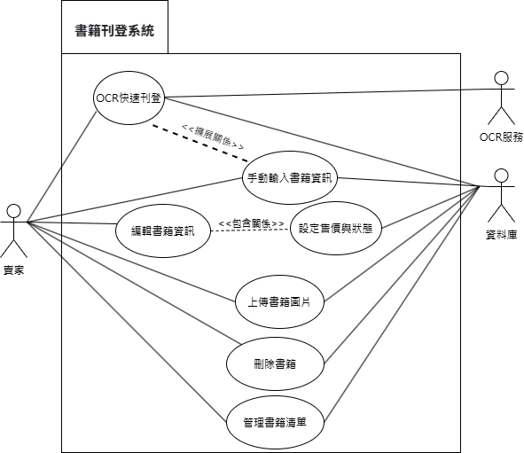
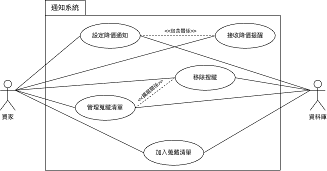

# 功能性需求
### 1. 用戶註冊與安全（買賣家）
* 用戶必須為高科大學生，須持有學校電子郵件，方可註冊。
* 註冊時需提供用戶名、密碼、高科大電子郵件。
* 系統會驗證電子郵件是否為高科大使用信箱（即為「nkust.edu.tw」)。
* 若忘記密碼，需重新輸入高科大電子信箱，收取驗證碼，重設密碼。

### 2. 書籍刊登/編輯/刪除（賣家）
* **OCR 快速刊登**：賣家可使用 OCR 技術掃描書籍封面或 ISBN 碼，系統需自動識別並填入書籍相關資訊。
* **資訊手動補充與編輯**：當 OCR 辨識失敗或資訊不完整時，允許賣家手動輸入或修改書籍資訊。
* **設定書籍資訊**：賣家可設定書本的售價、上架狀態、商品描述等。
* **上傳書籍圖片**：允許賣家上傳書籍的實體照片。

### 3. 書籍搜尋與瀏覽資訊（買家）
* **關鍵字搜尋**： 買家可輸入書名等資訊進行搜尋。
* **多維度標籤篩選**： 提供如「科系」、「上架時間遠近」、「價錢高低」等標籤進行篩選。
* **書籍詳情頁面**： 買家可查看書籍的所有詳細資訊、圖片。

### 4. 互動與通知（買家）
* **降價通知提醒**：買家可針對特定書籍設定降價通知，當價格低於設定值時，系統應發送提醒。
* **加入追蹤/收藏**：買家可將有興趣的書籍加入收藏清單。

### 5. 聊天室（買賣家）
* 提供「上傳圖片」、「輸入文字」功能

# 非功能性需求
### 1. 效能
* **響應速度**：大多數面載入時間（例如書籍列表、搜尋結果頁）應在 3 秒內完成。
* **OCR 識別速度**：OCR 掃描並自動填充書籍資訊的過程應在 10 秒內完成。

### 2. 可用性與易用性
* **操作簡單**：APP 介面設計需直觀，首次使用者無需複雜說明即可快速完成書籍刊登和購買流程（特別是 OCR 輔助的刊登流程）。
* **介面一致性**：整個 APP 的設計風格、導航和操作流程應保持一致性。
* **錯誤訊息清晰**：系統錯誤（如網路連線問題、OCR 辨識失敗）應以使用者容易理解的方式呈現，並提供解決建議。
* **行動裝置適應性**：介面應能良好地適應不同尺寸和解析度的手機螢幕。

### 3. 安全性
* **身份驗證安全**：學校身份驗證機制應能有效防止非本校人員冒充。
* **隱私保護**：買賣家用戶名稱採取匿名方式。

# 功能分解圖

# 使用案例圖/使用案例說明
### 1. 用戶註冊與安全
> #### 使用案例圖

> #### 使用案例說明
* **用戶註冊**
  #### 參與者：賣家、買家

  #### 簡述：允許高科大學生可以註冊帳號。

  #### 基本流程：
  1) 用戶選擇「註冊」功能。
  2) 系統要求用戶輸入用戶名、密碼及高科大電子郵件（@nkust.edu.tw）。
  3) 用戶點擊郵件查看驗證碼。
  4) 用戶回到系統註冊頁面輸入驗證碼。
  5) 系統顯示「註冊成功」並導引至登入頁面。

  #### 包含關係（Include）：
  * 在第二步驟，用戶輸入完高科大電子郵件後，系統執行「電子郵件驗證」流程，向郵箱發送驗證碼。
  
* **用戶登入**
  #### 參與者：賣家、買家
  
  #### 簡述：允許高科大學生可以登入系統。
  
  #### 基本流程：
  1) 用戶輸入用戶名（或信箱）及密碼。
  2) 系統驗證帳號密碼是否匹配。
  3) 驗證成功，用戶登入系統。
  
* **忘記密碼**
  #### 參與者：賣家、買家
  
  #### 簡述：用戶若忘記密碼，可以重新設定密碼，並做登入。
  
  #### 基本流程：
  1) 用戶選擇「忘記密碼」。
  2) 系統要求用戶輸入註冊時使用的高科大電子信箱。
  3) 系統向該信箱發送重設密碼的驗證碼。
  4) 系統提示密碼重設成功。

  #### 包含關係（Include）：
  * 系統執行「重設密碼」流程，讓用戶設定新密碼。

* **前置條件**
  * 用戶必須能連線至網際網路。
  * (登入時) 用戶必須已經註冊並通過驗證。

* **後置條件**
  * 成功註冊後，系統新增一筆已驗證的高科大用戶記錄。
  * 成功登入後，用戶獲得 Session 並進入主頁面。

### 2. 書籍刊登/編輯/刪除
> #### 使用案例圖

> #### 使用案例說明
* **OCR快速刊登**
  #### 參與者：賣家
  
  #### 簡述：賣家透過拍攝書籍的 ISBN 條碼或書封，讓系統自動辨識並填入書籍資訊，以達到快速刊登的目的。

  #### 基本流程：
  1) 賣家在畫面選擇「OCR快速刊登」功能。
  2) 系統啟動相機掃描功能。
  3) 賣家將鏡頭對準書籍的 ISBN 條碼。
  4) 系統成功辨識條碼後，自動向後端的 OCR服務 或書籍資料庫查詢。
  5) 系統查詢成功，自動將書名、作者、出版社等資訊填入刊登資訊欄。
  6) 賣家檢查資訊無誤，設定售價與書況後，點擊「確認刊登」。
  7) 系統將此筆書籍資料存入資料庫，刊登完成。
  
  #### 擴展/替代流程 (Extend)：
  * OCR辨識失敗或不準確：如果在第四步辨識失敗，或第五步回傳的資料不正確，系統會提示賣家「辨識失敗，將改成手動輸入」，流程將擴展至「手動輸入書籍資訊」。
  
* **手動輸入書籍資訊**
  #### 參與者：賣家

  #### 簡述：賣家手動填寫表單上的所有欄位來刊登書籍。
  
  #### 基本流程：
  1) 賣家選擇「手動刊登」。
  2) 系統顯示刊登表單及欄位。
  3) 賣家手動輸入書名、作者、ISBN、出版社等資訊。
  4) 賣家設定售價、書況並上傳圖片。
  5) 賣家點擊「確認刊登」。
  6) 系統將資料存入資料庫，刊登完成。
    
* **編輯書籍資訊**
  #### 參與者：賣家
  
  #### 簡述：修改已經刊登的書籍的詳細資料。
  
  #### 基本流程：
  1) 賣家進入「管理書籍清單」頁面，找到想修改的書籍。
  2) 賣家點擊該書籍的「編輯」按鈕。
  3) 系統顯示已填寫好的書籍資訊表單。
  4) 賣家在此頁面修改書名、作者等文字敘述，同時也一定會看到並可以修改【設定售價與狀態】的欄位。
  5) 賣家修改完畢後，點擊「儲存變更」。
  6) 系統更新資料庫中的對應資料。
  
  #### 前置條件：該書籍必須已存在於賣家的刊登清單中。
  
* **設定售價與狀態**
  #### 參與者：(無直接參與者)

  #### 簡述：此為一個被包含的功能片段，負責處理書籍的價格與「已上架/交易中/已售出/已下架」等狀態的設定，本身無法獨立執行。

  #### 觸發方式：當「編輯書籍資訊」使用案例被執行時，此功能必定會被包含在其中。
  
* **上傳書籍圖片**
  #### 參與者：賣家

  #### 簡述：為書籍新增或更換照片。

  #### 基本流程：
  1) 賣家找到目標書籍，並選擇「編輯圖片」。
  2) 系統顯示目前的圖片列表，並提供「新增圖片」按鈕。
  3) 賣家點擊新增，從手機選擇要上傳的圖片檔。
  4) 系統將圖片上傳，並與該書籍資料關聯，存入資料庫或檔案系統。
  5) 賣家可以設定封面圖片，或刪除不要的圖片。
  
* **刪除書籍**
  #### 參與者：賣家

  #### 簡述：從刊登清單中永久移除書籍。

  #### 基本流程：
  1) 賣家在「管理書籍清單」中找到要刪除的書籍。
  2) 賣家點擊「刪除」。
  3) 系統跳出確認視窗：「確定要刪除這筆上架書籍嗎？此操作無法復原。」
  4) 賣家點擊「確定」。
  5) 系統從資料庫中移除該筆書籍資料。

### 3. 書籍搜尋與瀏覽資訊
> #### 使用案例圖

> #### 使用案例說明
* **關鍵字搜尋**
  #### 參與者：買家

  #### 簡述：買家透過關鍵字搜尋，可以搜尋到自己想要的書籍。

  #### 基本流程：
  1) 買家在搜尋欄位輸入書名、作者等關鍵字。
  2) 系統利用「搜尋引擎」在資料庫中執行查詢。
  3) 系統執行「瀏覽書籍清單」用例，顯示結果。

  #### 擴展/替代流程 (Extend)：
  * 買家可以在步驟二，進一步執行「多維度篩選」來優化結果，也可以選擇不透過搜尋引擎，直接進行「多維度篩選」。
  * 搜尋無結果：系統未找到符合關鍵字的書籍，提示「無符合條件的書籍」。

* **多維度篩選**
  #### 參與者：買家

  #### 簡述：買家透過多維度篩選來優化搜尋結果，更快找到自己想要的書籍。
  
  #### 基本流程：
  1) 買家開啟篩選面板，設定如科系、時間排序等條件。
  2) 系統根據篩選和排序條件重新查詢資料庫。
  3) 系統執行「瀏覽書籍清單」用例，顯示結果。

  #### 擴展/替代流程 (Extend)：
  * 買家可選擇「科系篩選」、「時間排序」等功能。

* **查看書籍詳情**
  #### 參與者：買家
  
  #### 簡述：提供買家瀏覽書籍資訊。
  
  #### 基本流程：
  1) 買家從清單中點選特定書籍。
  2) 系統從資料庫中擷取該書籍的完整資料（描述、賣家資訊等）並呈現。

  #### 擴展/替代流程 (Extend)：
  * 買家可進一步點擊「查看書籍圖片」用例來瀏覽圖片細節，以及書籍詳細資訊。

* **前置條件**
  * 用戶已登入。
  * 系統中存在已刊登的二手書資料。

* **後置條件**
  * 系統顯示符合條件的書籍清單。
  * 用戶成功查看到特定書籍的詳細資訊。

### 4. 互動與通知
> #### 使用案例圖

> #### 使用案例說明
* **加入蒐藏清單**
  #### 參與者：買家
  
  #### 簡述：買家可以將自己偏好、喜歡的書籍，加入蒐藏清單。
  
  #### 基本流程：
  1) 買家在書籍詳情頁面點擊「追蹤/收藏」按鈕。
  2) 系統將該書籍的 ID 加入買家的追蹤清單，並更新資料庫。
  3) 系統提示「已加入收藏」。
  
* **管理蒐藏清單**
  #### 參與者：買家
  
  #### 簡述：買家可以在蒐藏清單中看見自己的蒐藏書籍。
  
  #### 基本流程：
  1) 買家進入個人頁面的「收藏清單」。
  2) 系統從資料庫擷取清單並顯示。

  #### 擴展/替代流程 (Extend)：
  * 買家可在第一步驟後，執行「移除收藏」，將書籍從清單中移除。
  
* **設定降價通知**
  #### 參與者：買家
  
  #### 簡述：若買家想要收到降價通知提醒，可以將通知開啟。
  
  #### 基本流程：
  1) 買家針對某本收藏書籍設定期望的價格閾值。
  2) 系統在資料庫中記錄此設定。

  #### 包含關係（Include）：
  * 當書籍價格變動且低於設定值時，系統自動觸發「接收降價提醒」流程。
  
* **接收降價提醒**
  #### 參與者：買家
  
  #### 簡述：將設定降價通知後，買家即可收到降價通知的提醒。
  
  #### 基本流程：
  1) 系統檢測到書籍價格變動符合買家設定的條件。
  2) 系統向買家發送 APP 推播通知。
  3) 買家收到並查看通知。

* **前置條件**
  * 用戶已登入。
  * 用戶已找到感興趣的書籍。

* **後置條件**
  * 追蹤清單在資料庫中得到更新。
  * 降價條件觸發時，系統發送通知。

### 5. 聊天室
> #### 使用案例圖

> #### 使用案例說明
* **傳送訊息** 
  #### 簡述：代表了所有傳送訊息的行為，本身不直接被執行，而是由子案例「傳送文字」和「傳送圖片」來實現。

* **傳送文字** 
  #### 參與者：買家、賣家

  #### 簡述：在聊天室中輸入並發送純文字訊息。

  #### 基本流程：
  1) 使用者進入與另一方的聊天室。
  2) 在輸入框中打字。
  3) 點擊「發送」按鈕。
  4) 系統將文字訊息傳送至「聊天伺服器」。
  5) 「聊天伺服器」將訊息推送給對方，並儲存記錄。

* **傳送圖片** 
  #### 參與者：買家、賣家

  #### 簡述：在聊天室中選擇並發送圖片。

  #### 基本流程：
  1) 使用者進入聊天室。
  2) 點擊「+」，選擇圖片。
  3) 從裝置的相簿中選擇一張或多張圖片。
  4) 系統將圖片上傳至「檔案伺服器」。
  5) 上傳成功後，系統將圖片連結傳送至「聊天伺服器」。
  6) 「聊天伺服器」將此訊息推送給對方。

* **查看聊天記錄**
  #### 參與者：買家、賣家

  #### 簡述：進入聊天室，查看與某個對象過去所有的對話內容。

  #### 基本流程：
  1) 使用者從聯絡人清單點擊某個對話。
  2) 系統向「聊天伺服器」請求該聊天室的所有歷史訊息。
  3) 對於訊息中的圖片連結，系統再向「檔案伺服器」請求對應的圖片。
  4) 系統將所有文字和圖片按時間順序呈現在畫面上。

* **建立聊天室**
  #### 參與者：買家

  #### 簡述：買家主動向某位賣家發起一個新的對話。

  #### 基本流程：

  1) 買家在某個商品頁面頁面。
  2) 點擊「聊天室」按鈕。
  3) 系統檢查買家與賣家之間是否已存在聊天室。
  4) 如果不存在，系統會請求「聊天伺服器」建立一個新的聊天室，並將買賣雙方加入。
  5) 系統自動跳轉至這個新的、空白的聊天室畫面。

  #### 前置條件：買家必須已登入。

  #### 後置條件：一個新的聊天室在買賣雙方之間被建立。
