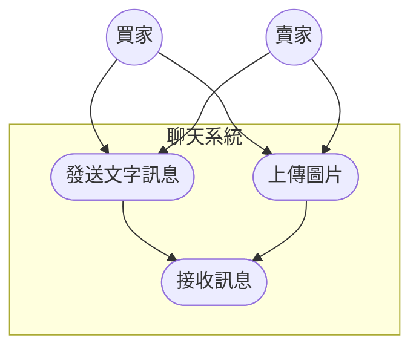

# 功能性需求
### 1. 用戶註冊與安全（買賣家）
* 用戶必須為高科大學生，須持有學校電子郵件，方可註冊。
* 註冊時需提供用戶名、密碼、高科大電子郵件。
* 系統會驗證電子郵件是否為高科大使用信箱（即為「nkust.edu.tw」)。
* 若忘記密碼，需重新輸入高科大電子信箱，收取驗證碼，重設密碼。

### 2. 書籍刊登/編輯/刪除（賣家）
* **OCR 快速刊登**：賣家可使用 OCR 技術掃描書籍封面或 ISBN 碼，系統需自動識別並填入書籍相關資訊。
* **資訊手動補充與編輯**：當 OCR 辨識失敗或資訊不完整時，允許賣家手動輸入或修改書籍資訊。
* **設定書籍資訊**：賣家可設定書本的售價、上架狀態、商品描述等。
* **上傳書籍圖片**：允許賣家上傳書籍的實體照片。

### 3. 書籍搜尋與瀏覽資訊（買家）
* **關鍵字搜尋**： 買家可輸入書名等資訊進行搜尋。
* **多維度標籤篩選**： 提供如「科系」、「上架時間遠近」、「價錢高低」等標籤進行篩選。
* **書籍詳情頁面**： 買家可查看書籍的所有詳細資訊、圖片。

### 4. 互動與通知（買家）
* **降價通知提醒**：買家可針對特定書籍設定降價通知，當價格低於設定值時，系統應發送提醒。
* **加入追蹤/收藏**：買家可將有興趣的書籍加入收藏清單。

### 5. 聊天室（買賣家）
* 提供「上傳圖片」、「輸入文字」功能

# 非功能性需求
### 1. 效能
* **響應速度**：大多數面載入時間（例如書籍列表、搜尋結果頁）應在 3 秒內完成。
* **OCR 識別速度**：OCR 掃描並自動填充書籍資訊的過程應在 10 秒內完成。

### 2. 可用性與易用性
* **操作簡單**：APP 介面設計需直觀，首次使用者無需複雜說明即可快速完成書籍刊登和購買流程（特別是 OCR 輔助的刊登流程）。
* **介面一致性**：整個 APP 的設計風格、導航和操作流程應保持一致性。
* **錯誤訊息清晰**：系統錯誤（如網路連線問題、OCR 辨識失敗）應以使用者容易理解的方式呈現，並提供解決建議。
* **行動裝置適應性**：介面應能良好地適應不同尺寸和解析度的手機螢幕。

### 3. 安全性
* **身份驗證安全**：學校身份驗證機制應能有效防止非本校人員冒充。
* **隱私保護**：買賣家用戶名稱採取匿名方式。

# 功能分解圖

# 使用案例圖
### 1. 用戶註冊與安全

### 2. 書籍刊登/編輯/刪除

### 3. 書籍搜尋與瀏覽資訊

### 4. 互動與通知

### 5. 聊天室

# 使用案例說明
