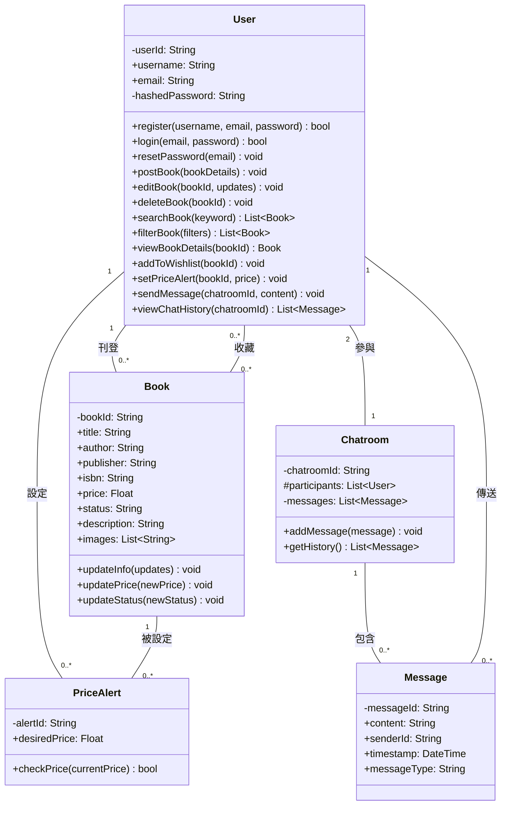
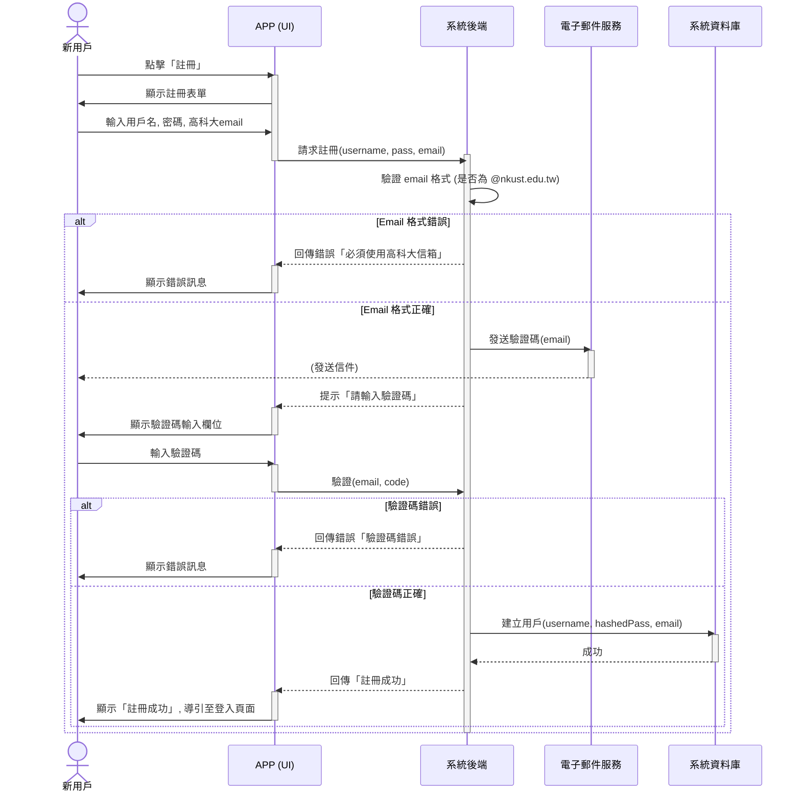
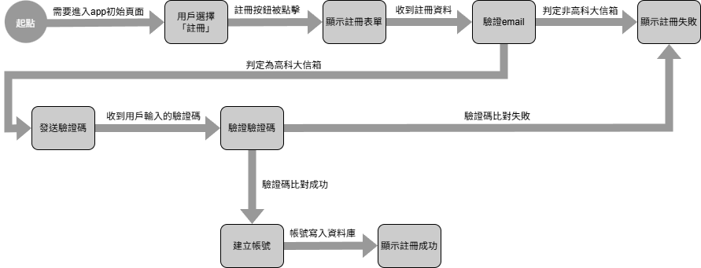

# UML 類別圖

```mermaid
classDiagram
    class User {
        -userId: String
        +username: String
        +email: String
        -hashedPassword: String
        +register(username, email, password) bool
        +login(email, password) bool
        +resetPassword(email) void
        +postBook(bookDetails) void
        +editBook(bookId, updates) void
        +deleteBook(bookId) void
        +searchBook(keyword) List~Book~
        +filterBook(filters) List~Book~
        +viewBookDetails(bookId) Book
        +addToWishlist(bookId) void
        +setPriceAlert(bookId, price) void
        +sendMessage(chatroomId, content) void
        +viewChatHistory(chatroomId) List~Message~
    }

    class Book {
        -bookId: String
        +title: String
        +author: String
        +publisher: String
        +isbn: String
        +price: Float
        +status: String
        +description: String
        +images: List~String~
        +updateInfo(updates) void
        +updatePrice(newPrice) void
        +updateStatus(newStatus) void
    }

    class PriceAlert {
        -alertId: String
        +desiredPrice: Float
        +checkPrice(currentPrice) bool
    }

    class Chatroom {
        -chatroomId: String
        #participants: List~User~
        -messages: List~Message~
        +addMessage(message) void
        +getHistory() List~Message~
    }

    class Message {
        -messageId: String
        +content: String
        +senderId: String
        +timestamp: DateTime
        +messageType: String
    }

    User "1" -- "0..*" Book : 刊登
    User "0..*" -- "0..*" Book : 收藏
    User "1" -- "0..*" PriceAlert : 設定
    Book "1" -- "0..*" PriceAlert : 被設定
    User "2" -- "1" Chatroom : 參與
    Chatroom "1" -- "0..*" Message : 包含
    User "1" -- "0..*" Message : 傳送
```

# 使用案例的循序圖與活動圖

## 使用案例一：用戶註冊

* ### 循序圖

```mermaid
    sequenceDiagram
    actor User as 新用戶
    participant AppUI as APP (UI)
    participant Backend as 系統後端
    participant EmailService as 電子郵件服務
    participant Database as 系統資料庫

    User ->> AppUI: 點擊「註冊」
    activate AppUI
    AppUI ->> User: 顯示註冊表單
    
    User ->> AppUI: 輸入用戶名, 密碼, 高科大email
    AppUI ->> Backend: 請求註冊(username, pass, email)
    activate Backend
    deactivate AppUI

    Backend ->> Backend: 驗證 email 格式 (是否為 @nkust.edu.tw)
    alt Email 格式錯誤
        Backend -->> AppUI: 回傳錯誤「必須使用高科大信箱」
        activate AppUI
        AppUI ->> User: 顯示錯誤訊息
        deactivate AppUI
    else Email 格式正確
        Backend ->> EmailService: 發送驗證碼(email)
        activate EmailService
        EmailService -->> User: (發送信件)
        deactivate EmailService
        
        Backend -->> AppUI: 提示「請輸入驗證碼」
        activate AppUI
        AppUI ->> User: 顯示驗證碼輸入欄位
        deactivate AppUI

        User ->> AppUI: 輸入驗證碼
        activate AppUI
        AppUI ->> Backend: 驗證(email, code)
        deactivate AppUI
        
        alt 驗證碼錯誤
            Backend -->> AppUI: 回傳錯誤「驗證碼錯誤」
            activate AppUI
            AppUI ->> User: 顯示錯誤訊息
            deactivate AppUI
        else 驗證碼正確
            Backend ->> Database: 建立用戶(username, hashedPass, email)
            activate Database
            Database -->> Backend: 成功
            deactivate Database
            
            Backend -->> AppUI: 回傳「註冊成功」
            activate AppUI
            AppUI ->> User: 顯示「註冊成功」, 導引至登入頁面
            deactivate AppUI
        end
    end
    deactivate Backend
```

* ### 活動圖

## 使用案例二
## 使用案例三
