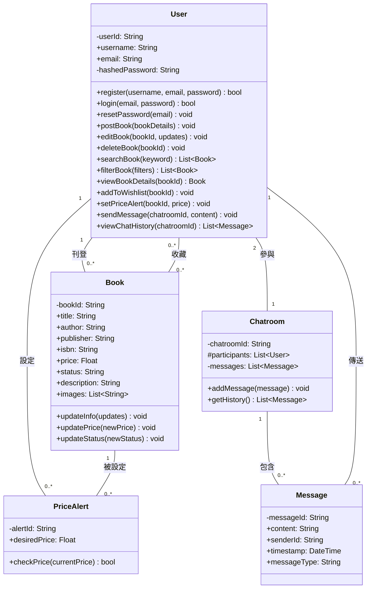

## UML 類別圖

```mermaid
classDiagram
    class User {
        -userId: String
        +username: String
        +email: String
        -hashedPassword: String
        +register(username, email, password) bool
        +login(email, password) bool
        +resetPassword(email) void
        +postBook(bookDetails) void
        +editBook(bookId, updates) void
        +deleteBook(bookId) void
        +searchBook(keyword) List~Book~
        +filterBook(filters) List~Book~
        +viewBookDetails(bookId) Book
        +addToWishlist(bookId) void
        +setPriceAlert(bookId, price) void
        +sendMessage(chatroomId, content) void
        +viewChatHistory(chatroomId) List~Message~
    }

    class Book {
        -bookId: String
        +title: String
        +author: String
        +publisher: String
        +isbn: String
        +price: Float
        +status: String
        +description: String
        +images: List~String~
        +updateInfo(updates) void
        +updatePrice(newPrice) void
        +updateStatus(newStatus) void
    }

    class PriceAlert {
        -alertId: String
        +desiredPrice: Float
        +checkPrice(currentPrice) bool
    }

    class Chatroom {
        -chatroomId: String
        #participants: List~User~
        -messages: List~Message~
        +addMessage(message) void
        +getHistory() List~Message~
    }

    class Message {
        -messageId: String
        +content: String
        +senderId: String
        +timestamp: DateTime
        +messageType: String
    }

    User "1" -- "0..*" Book : 刊登
    User "0..*" -- "0..*" Book : 收藏
    User "1" -- "0..*" PriceAlert : 設定
    Book "1" -- "0..*" PriceAlert : 被設定
    User "2" -- "1" Chatroom : 參與
    Chatroom "1" -- "0..*" Message : 包含
    User "1" -- "0..*" Message : 傳送
```

## 循序圖與活動圖
