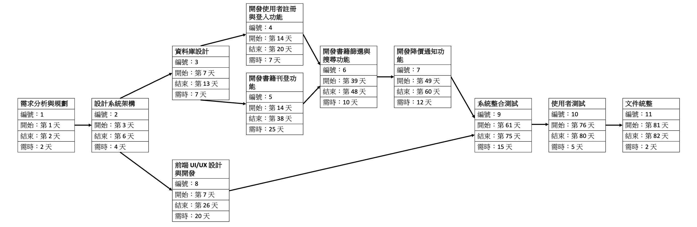
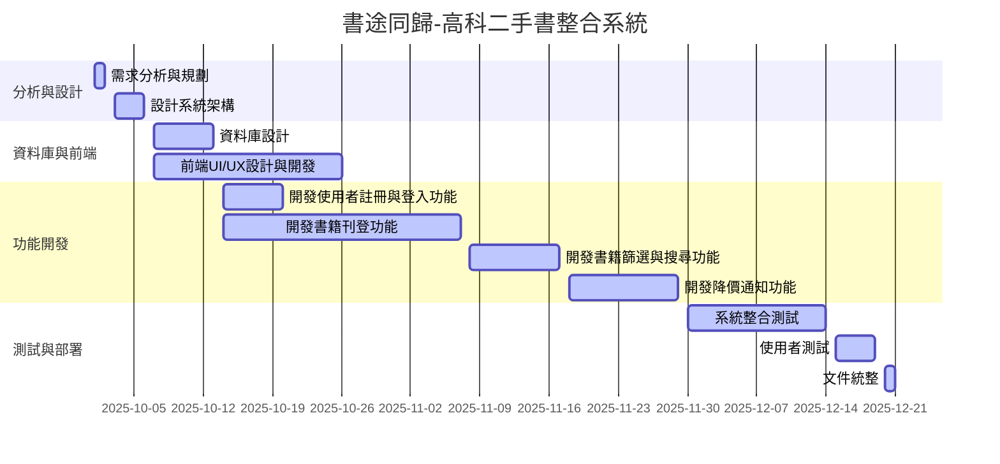

# PERT/CPM 圖

### 關鍵路徑：1 → 2 → 3 → 5 → 6 → 7 → 9 → 10 → 11
# 工作分配
| 工作項目                  | 陳文嬡 | 林子歆 |
|---------------------------|--------|--------|
| 需求分析與規劃            | ✔️     | ✔️     |
| 設計系統架構              | ✔️     | ✔️     |
| 資料庫設計                | ✔️     | ✔️     |
| 前端 UI/UX 設計與開發     | ✔️     |        |
| 開發使用者註冊與登入功能   |        | ✔️     |
| 開發書籍刊登功能          | ✔️     |        |
| 開發書籍篩選與搜尋功能    |        | ✔️     |
| 開發降價通知功能          | ✔️     |        |
| 系統整合測試              |        | ✔️     |
| 使用者測試                | ✔️     | ✔️     |
| 文件統整                  | ✔️     | ✔️     |

# 甘特圖

